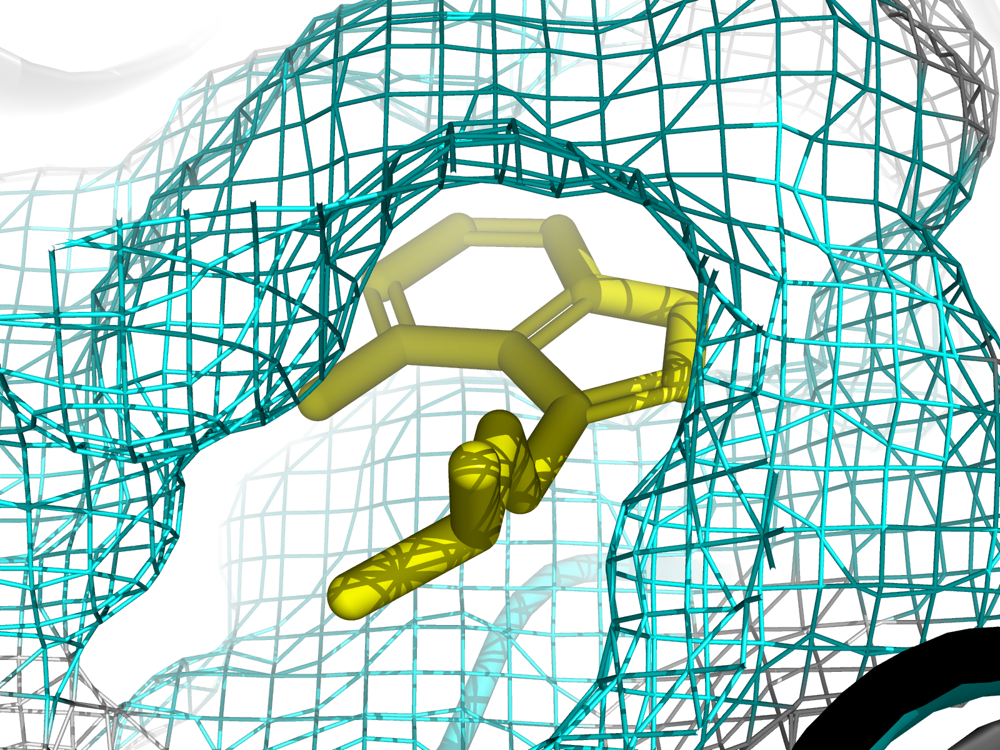

# THE LATTICE INTERFACE PROTOCOL (LIP)

### Dynamic 5-HT2A Modulation via Biased Agonism & Bio-Acoustic Feedback

**Status:** In-Silico Development / Acoustic Prototyping
**Principal Investigator:** Juan Marcos Guerrero Sanz

  

  <em>Fig 1. High-resolution In-Silico modeling of the "Fast Off-Rate" Ligand within the 5-HT2A Orthosteric Pocket.</em>

---

## 1. Abstract
The Lattice Interface Protocol (LIP) proposes a novel mechanism to bypass the immediate tolerance (tachyphylaxis) associated with 5-HT2A receptor activation. By combining a theoretically designed "Fast Off-Rate" ligand with a Bio-Acoustic Feedback Loop, LIP aims to sustain high-bandwidth consciousness states without triggering Beta-Arrestin recruitment or adrenergic overload.

## 2. The Core Hypothesis
* **The Problem:** Standard psychedelic agonists induce rapid receptor internalization via the Beta-Arrestin pathway (The "Circuit Breaker").
* **The Chemical Solution:** A modified Indole-based ligand designed for rapid oscillation (Fast Off-Rate) within the orthosteric pocket, effectively "hiding" from GRK phosphorylation while maintaining Gq signaling.
* **The Acoustic Solution:** A real-time Haptic Audio Engine anchored at **144Hz (Basal Frequency)**, side-chained to the user's parasympathetic respiratory rhythm to modulate intensity and prevent anxiety.

## 3. Repository Contents
* **`/One-Pager.jpg`**: Scientific summary of the molecular mechanism and structural hypothesis.
* **`/DEMO 144 Hzx Gido.wav`**: Acoustic Prototype v1. A binaural anchor frequency (144Hz) modulated by a biological respiratory curve (Golden Ratio amplitude) to induce parasympathetic resonance.

---
*Disclaimer: This is a theoretical research project for educational and scientific exploration purposes.*
